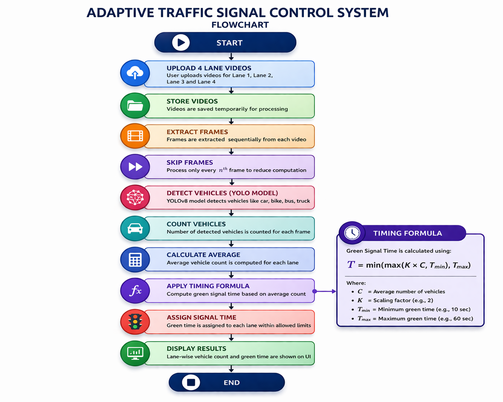

# 🚦 Adaptive Traffic Signal Control System

<p align="center">
  
  
  
  
  
</p>

> A deep learning–based traffic management system that analyzes vehicle density across 4 lanes and dynamically assigns green signal time — so no lane waits longer than it needs to.

---

## 💡 Motivation

Every day while commuting to college in a rickshaw, I noticed the same thing — sitting at a red signal with absolutely no vehicles on the other three sides. Just waiting. For nothing.

Traditional traffic signals run on **fixed timers** — every lane gets the same green time regardless of whether there are 30 vehicles or zero. That's not traffic management, that's just a clock.

The idea was simple: **what if the signal could see how many vehicles are actually there and decide the green time accordingly?**

That thought turned into this mini project — built with a friend for a Deep Learning submission, but driven by a real frustration we both face daily. You upload videos from 4 lanes, the system counts the vehicles using YOLOv8, and assigns each lane a green time proportional to its traffic — with a minimum and maximum cap so no single lane dominates indefinitely.

---

## ⚙️ How It Works

```
Upload videos for Lane 1, Lane 2, Lane 3, Lane 4
                    │
                    ▼
        Extract frames (every 5th frame)
                    │
                    ▼
     YOLOv8 detects vehicles per frame
     (car, bike, bus, truck)
                    │
                    ▼
     Average vehicle count calculated per lane
                    │
                    ▼
        Apply Timing Formula:
        T = min(max(K × C, Tmin), Tmax)
                    │
                    ▼
     Assign green signal time to each lane
                    │
                    ▼
        Display results on Streamlit UI
```

### 🧮 Timing Formula

```
T = min(max(K × C, Tmin), Tmax)
```

| Variable | Meaning | Default |
|----------|---------|---------|
| `C` | Average vehicle count | — |
| `K` | Scaling factor | 2 |
| `Tmin` | Minimum green time | 10 sec |
| `Tmax` | Maximum green time | 60 sec |

This ensures that even an empty lane gets at least 10 seconds, and no single lane gets more than 60 seconds — preventing one busy lane from starving the others.

### 🚗 Traffic Status Labels

| Vehicles | Status |
|----------|--------|
| 0 | EMPTY |
| < 10 | NORMAL |
| ≥ 10 | HEAVY |

---

## 🛠️ Tech Stack

| Component | Technology |
|-----------|------------|
| Vehicle Detection | YOLOv8n (Ultralytics) |
| Video Processing | OpenCV |
| Frontend / UI | Streamlit |
| Language | Python |

---

## 📂 Project Structure

```
Traffic_management/
│
├── backend/
│   ├── detection.py        # YOLOv8 vehicle detection per frame
│   ├── traffic_logic.py    # Green time formula & traffic status
│   └── main.py             # Lane processing & signal controller
│
├── frontend/
│   ├── app.py              # Streamlit UI
│   └── yolov8n.pt          # YOLOv8 model weights
│
└── README.md
```

---

## ▶️ How to Run Locally

### 1. Clone the repository

```bash
git clone https://github.com/your-username/Traffic_management.git
cd Traffic_management
```

### 2. Install dependencies

```bash
pip install ultralytics opencv-python streamlit
```

### 3. Run the app

```bash
streamlit run frontend/app.py
```

Then open `http://localhost:8501` in your browser, upload videos for each lane, and hit **Run System**.

---

## 🖼️ System Flowchart



---

## 🚀 Future Improvements

- [ ] Live CCTV / RTSP stream support instead of video uploads
- [ ] Real-time lane switching logic with countdown timer UI
- [ ] Emergency vehicle detection (ambulance priority override)
- [ ] Multi-intersection coordination
- [ ] Web deployment (cloud hosted)

---

## 👥 Team

| Name | Role |
|------|------|
| Pratik Singh | Idea, Backend Logic, Integration |
| Apoorva Patil | Frontend, Testing, documentation & research support |

---

> Built out of a daily frustration — because sitting at an empty red light for 90 seconds is 90 seconds too many.
